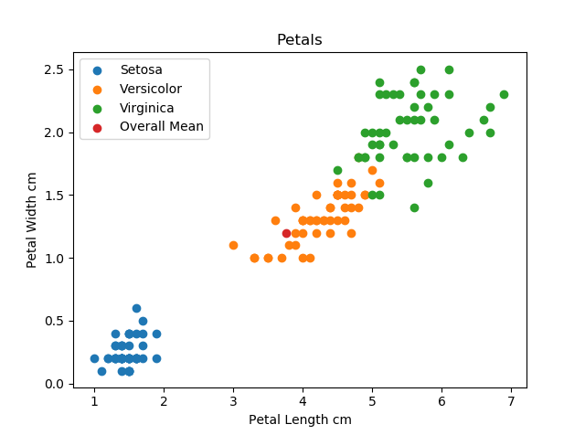
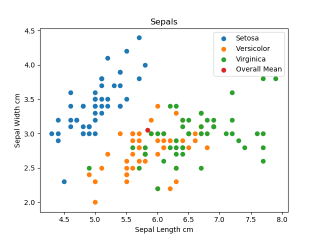

# Project-2018 - The Iris Flower Dataset

## Backround to the Iris Flower Dataset

According to [TechTarget](https://whatis.techtarget.com/definition/data-set), "A data set is a collection of related, discrete items of related data that may be accessed individually or in combination or managed as a whole entity".  The data itself could relate to anything from  money to nature, broad and comprehensive sample to narrow and restricted.  The most common layout for a dataset is in matrix form with the columns representing the variables and the rows giving the dataset members values for each variable. This is the layout of The Iris Flower Dataset which is the subject of this submission.

[The Iris Flower Dataset](https://en.wikipedia.org/wiki/Iris_flower_data_set) is also known as [Fisher's](https://en.wikipedia.org/wiki/Ronald_Fisher) Iris data set, after the British statistician and Biologist Ronald Fisher.
The dataset was compiled by taking 50 samples each of three different species of Iris flower, Iris Setosa, Iris Virginica and Iris Versicolor.  For each sample taken four different measurements were recorded, the sepal length, the sepal width, the petal length and the petal width, all in centimetres. In keeping with the standard matrix format the first column represents **Petal Length**, the second **Petal Width**, the third **Sepal Length**, the fourth **Sepal Width** and fifth column stating the **Species** or **Class** of Iris.  There are then 150 rows with values for each variable, 50 of each class.

The Iris dataset is famous and is used as a standard testing tool for new data analysis techniques.

## Using Python to analyse the Iris Flower dataset
[Python](https://www.python.org/) is a high level computer programming language that is used in project for analysing the data within the Iris Flower Dataset.
I first started by importing [Numpy](http://www.numpy.org/) which is a package for scientific computing with Python.  There are a number of commands within Numpy that allow for the analyising of array of data such as the Iris Flower dataset.  Utilising these commands as shown in the Irisanalysis.py file in the repository I was able to establish the maximum, minimum and mean values for each of the Iris flower classes in the set aswell as the overall figures.  

The results of these analytics were as follows:
The Virginica class has the highest maximum petal length with 6.9 cm
The Setosa class has the lowest minimum petal length with 1.0 cm
The average petal length across all the classes is 3.76 cm with a standard deviation of 1.759
The Virginica class has the highest maximum petal width with 2.5 cm
The Setosa class has the lowest minimum petal width with 0.1 cm
The average petal width across all the classes is 1.2 cm with a standard deviation of 0.761
The Virginica class has the highest maximum sepal length with 7.9 cm
The Setosa class has the lowest minimum sepal length with 4.3 cm
The average sepal length across all the classes is 5.84 cm with a standard deviation of 0.825
The Setosa class has the highest maximum sepal width with 4.4 cm
The Versicolor class has the lowest minimum sepal width with 2.0 cm
The average sepal width across all the classes is 3.05 cm with a standard deviation of 0.432

### Graphical Representations of the Data

To include graphics to illustrate the data findings I imported [Matplotlib](https://matplotlib.org/), which is a Python 2D plotting library that takes the raw data and offers a variety of different ways to represent it including everything from basic histograms to more advanced interactive formats.
I chose to use Scatter charts to display my findings on the dataset as I believe it givs the best visual understanding of the data.

By looking at both charts we can see that with regard to Petal size Setosa is clearly the smallest of the classes with Versicolor and Virginica being closer in size, Virginica being the largest of the three.

With regard to Sepal size, interestingly the Setosa class has on average a higher length than the other two classes but a lower that average width.  Again, both the Versicolor and Virginica classes are more alinged with each other than with the Setosa class.

